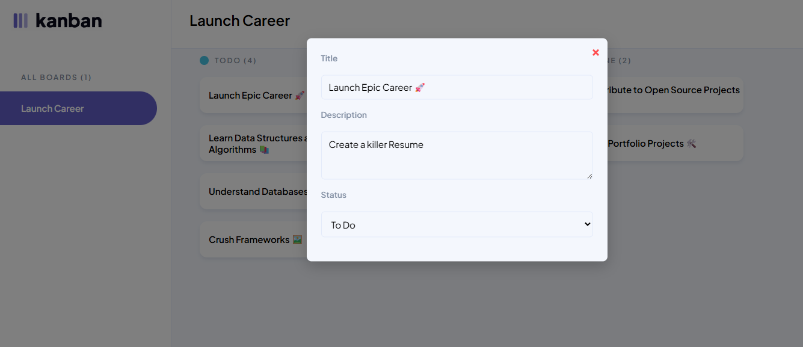
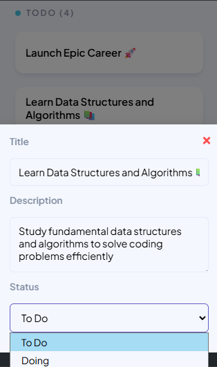

# JSL04 Project Brief: Dynamic Task Display & Modal View

## Overview

This project dynamically display tasks from the **given initial data** on the DOM using JavaScript. Tasks are placed into the correct **Kanban board columns** based on their status, and clicking a task should open a **modal** where users can view and modify task details. The project emphasizes **DOM manipulation, event handling, modular JavaScript structure, and responsive UI implementation.**

## Figma Design Link
 - This project follows this figma design and is pixel perfect, check it out.
 - [Figma Link](https://www.figma.com/design/y7bFCUYL5ZHfPeojACBXg2/Challenges-%7C-JSL?node-id=0-1&p=f&t=Ki0CZk0RAjrk9Fhs-0)

## Key Objectives

### Dynamic Task Display & Interaction

- Dynamically generate **task elements** from the given initial data and insert them into the DOM.
- Tasks are placed in  **correct columns** ("To Do", "In Progress", "Done") based on their status.
- Clicking a task **opens a modal** displaying its details.
- The modal should include:
  - **Editable input fields** for the task title and description.
  - **A select dropdown** showing the current status (todo, doing, done) with other status options available.
  - **A close button** that allows users to exit the modal easily.

### Design & Responsiveness
- It is responsive in Desktop view, Mobile & 4k
- Modal follows the figma desing (check the link)

### Code Structure & Maintainability 

- Formatted my code for readability using Prettier.
- Structure JavaScript using **modular, single-responsibility functions**.
- Used **descriptive and meaningful variable and function names** for clarity.
- Added **JSDoc comments** to major functions, describing their purpose, parameters, and return values for better documentation.

## Techonlogies ⚙️

- HTML
- CSS
- JavaScript

## Setup Intructions 🚀

- Clone the repository git clone [repository-url]
- Open the project folder Navigate to the directory where the files are stored
- Run locally Open index.html in your preferred browser (Chrome, Firefox, etc.). The task input prompts will appear automatically.

## Expected Outcome 📤

A fully functional **dynamic task board** where tasks appear under the correct columns, and users can **open a modal to view/edit** task details. The project will follow **clean, well-documented, and maintainable code practices**, ensuring a professional and scalable implementation.

 ### Fully functional Task Borad Modal (Desktop)

### Fully functional Mobile Task Board Modal With status dropdown

   

- The status ( done does shwow, I took the snipet in the inspect (developer)) 

# Thank You 😉
